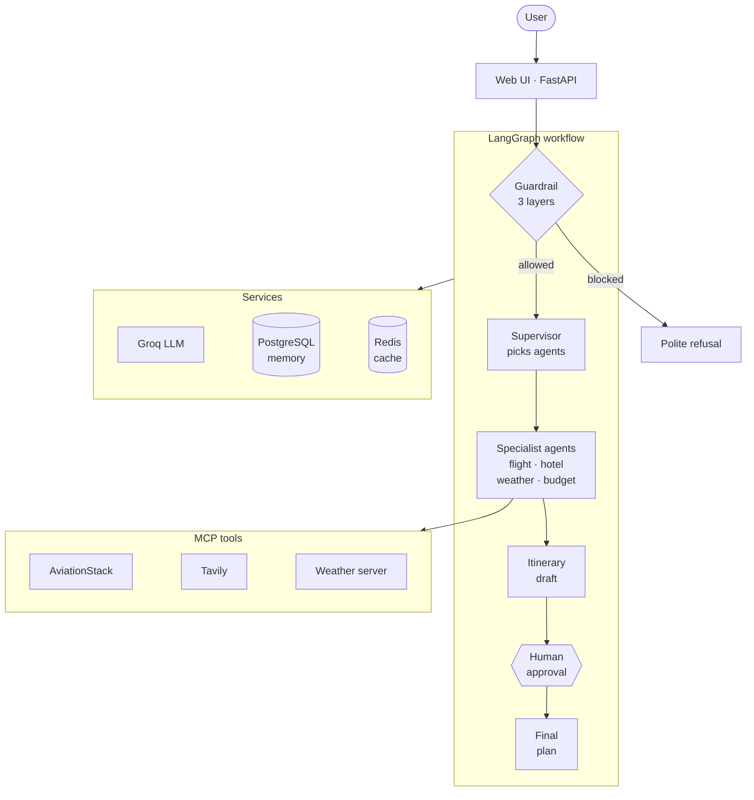

# TripMate AI: Multi-Agent Travel Planner

An AI travel planner where several specialist agents work together. You describe a trip ("5 days in Goa from Delhi under ₹30,000"). The agents gather flight, hotel, weather and budget information, and you **approve** a draft itinerary before the final plan is written.

Built with **LangGraph**, **MCP** (Model Context Protocol) and **FastAPI**, with a **supervisor agent**, layered **guardrails**, **human-in-the-loop** approval, **conversation memory** and a **Redis cache**.


## Problems it solves

| Problem | Solution |
|---|---|
| One LLM prompt can't reliably handle flights, hotels, weather and budget together | **Specialist agents**, each with its own tool |
| Simple questions trigger every search | A **supervisor** runs only the agents a request needs |
| Off-topic, prompt-injection and unsafe requests | A **3-layer guardrail** blocks them before any agent runs |
| The AI's plan is final, with no human control | **Human-in-the-loop:** the workflow pauses for your approval or feedback |
| Follow-ups like "change the budget to 25,000" lose context | **Conversation memory** in PostgreSQL updates the saved trip |
| One slow or failing API breaks the whole plan | **Timeouts and fallbacks:** a failed agent is skipped and the rest continue |

## Architecture



1. **Guardrail:** checks the message in three layers (input validation → regex rules → LLM classifier).
2. **Supervisor:** chooses the agents and extracts the trip details as validated JSON (**Pydantic**).
3. **Specialist agents:** get live data through **MCP** tools. Weather is cached in **Redis**.
4. **Itinerary agent:** combines the results into a draft.
5. **Human approval:** LangGraph's `interrupt()` pauses the run and saves it in **PostgreSQL**, until you approve or send feedback.
6. **Final agent:** writes the final plan, applying your feedback.

## Key features

- **Smart routing:** only the needed agents run, and follow-ups re-run only the agents the change affects.
- **Safe by design:** API keys are removed from every log and message, users get clear error codes (`400`, `404`, `409`, `503`), and model or web output is sanitised before it's shown in the browser.
- **Resilient:** every LLM and MCP call has a timeout, and the app keeps working if Redis or one agent is down.
- **Execution dashboard:** each response shows every agent's status, timing and cache hit/miss.
- **Tested:** 162 automated tests (no API keys needed), plus an evaluation harness with optional **LLM-as-a-judge** scoring.
- **Optional tracing** with **LangSmith**.

## Tech stack

| Area | Tools |
|---|---|
| Agents | LangGraph, LangChain, Groq (`llama-3.3-70b-versatile`) |
| Tools | MCP: AviationStack, Tavily, custom OpenWeather server |
| Backend | FastAPI, Pydantic |
| Storage | PostgreSQL (memory), Redis (cache) |
| Frontend | HTML, CSS, JavaScript |
| Quality and ops | pytest, LangSmith, Docker Compose |

## Project structure

```text
├── app.py                        # FastAPI routes and error handling
├── backend.py                    # LangGraph workflow: agents, routing, memory, approval
├── guardrails.py                 # 3-layer guardrail
├── schemas.py                    # Pydantic models
├── mcp_client.py                 # MCP client (AviationStack, Tavily, weather)
├── custom_weather_mcp_server.py  # Weather MCP server (OpenWeather)
├── weather_service.py, cache.py  # Weather lookup with Redis cache
├── dashboard.py, observability.py# Execution dashboard, logging, tracing
├── config.py, errors.py          # Settings and error types
├── templates/, static/           # Web UI
├── evaluation/                   # Evaluation harness (20 test cases, LLM judge)
├── tests/                        # 162 automated tests
├── docs/                         # Architecture and testing guides
├── Dockerfile, docker-compose.yml
└── requirements.txt, .env.example
```

## Getting started

You need API keys for **Groq**, **Tavily** and **OpenWeather** (AviationStack is optional).

**With Docker** (starts the app, PostgreSQL and Redis):

```bash
cp .env.example .env      # add your API keys and POSTGRES_PASSWORD
docker compose up --build
```

Then open http://localhost:8000.

**Without Docker** (needs Python 3.11+ and PostgreSQL):

```bash
pip install -r requirements.txt uv
cp .env.example .env      # add your API keys and DATABASE_URL
uvicorn app:app --port 8000
```

## API

| Endpoint | What it does |
|---|---|
| `POST /api/travel` | Plan a trip or send a follow-up: `{"message": "...", "thread_id": "optional"}` |
| `POST /api/travel/approve` | Approve or revise the draft: `{"thread_id": "...", "approved": true, "feedback": ""}` |
| `GET /health` | App, Redis and LangSmith status |

## Testing

```bash
pip install -r requirements-dev.txt
pytest                                # 162 tests, no API keys needed
python -m evaluation.run --mode live  # evaluate with the real model
```

## Documentation

- [Architecture](docs/architecture.md): how each part works, plus all edge cases and settings
- [Testing](docs/testing.md): test suite and evaluation details
